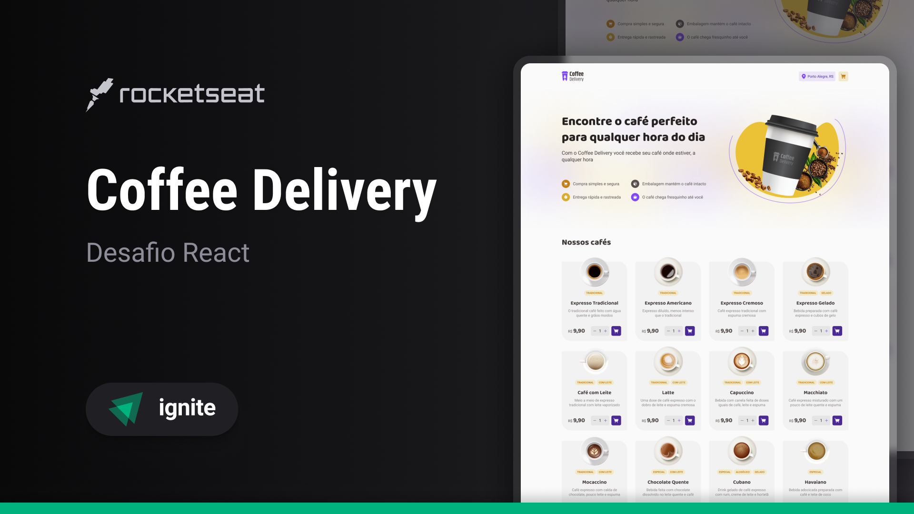

☕ Coffee Delivery

> Aplicação para gerenciar um carrinho de compras de uma cafeteria fictícia.



## 🚀 Sobre o Desafio

Este projeto foi desenvolvido para gerenciar um carrinho de compras de uma cafeteria fictícia, permitindo ao usuário:

✅ Listar produtos (cafés) disponíveis para compra
✅ Adicionar uma quantidade específica de itens no carrinho
✅ Aumentar ou remover a quantidade de itens no carrinho
✅ Preencher um formulário de endereço para entrega
✅ Exibir o total de itens no carrinho no Header
✅ Calcular o valor total do carrinho automaticamente

## 🛠️ Tecnologias Utilizadas

O projeto foi desenvolvido utilizando as seguintes tecnologias:

- ⚡ **[Vite](https://vitejs.dev/)** - Ambiente de desenvolvimento rápido para React
- 🟦 **[TypeScript](https://www.typescriptlang.org/)** - Superset do JavaScript
- 🎨 **[Styled-Components](https://styled-components.com/)** - Estilização utilizando CSS-in-JS
- 🌍 **[Axios](https://axios-http.com/)** - Cliente HTTP para requisições
- 🌎 **Geolocalização** - API para obter a localização do usuário com base no CEP
- 🏗️ **Context API** - Gerenciamento de estado global
- 📌 **React Hook Form + Zod** - Validação e gerenciamento de formulários

## 📦 Instalação e Execução

1. **Clone o repositório**

```sh
  git clone https://github.com/seu-usuario/coffee-delivery.git
```

2. **Acesse a pasta do projeto**

```sh
  cd coffee-delivery
```

3. **Instale as dependências**

```sh
  npm install
  # ou
  yarn install
```

4. **Execute o projeto**

```sh
  npm run dev
  # ou
  yarn dev
```

5. **Acesse no navegador**

```
http://localhost:5173
```

## 📸 Layout da Aplicação

O layout da aplicação foi baseado no design disponibilizado no Figma.

🔗 **[Acesse o layout no Figma](https://www.figma.com/file/5yT9ZzZmRQRS4yivGGB3pl/Coffee-Delivery/duplicate)**

## 📚 Conceitos Utilizados

✔️ Estados e imutabilidade
✔️ Context API para gerenciamento global de estados
✔️ LocalStorage para persistência de dados
✔️ Métodos de array como `reduce` para cálculos
✔️ Rotas utilizando `react-router-dom`
✔️ Formulários com `react-hook-form` e `zod`

## 📌 Dependências Principais

```json
{
  "@hookform/resolvers": "^3.10.0",
  "@phosphor-icons/react": "^2.1.7",
  "axios": "^1.7.9",
  "immer": "^10.1.1",
  "react": "^18.3.1",
  "react-dom": "^18.3.1",
  "react-hook-form": "^7.54.2",
  "react-router-dom": "^7.1.5",
  "styled-components": "^6.1.14",
  "zod": "^3.24.1"
}
```

## 📜 Licença

Este projeto está sob a licença MIT. Sinta-se à vontade para explorar, modificar e contribuir! 🧑‍💻✨

---

💙 **Desenvolvido por [Davi da Silva](https://github.com/davisllv)**
